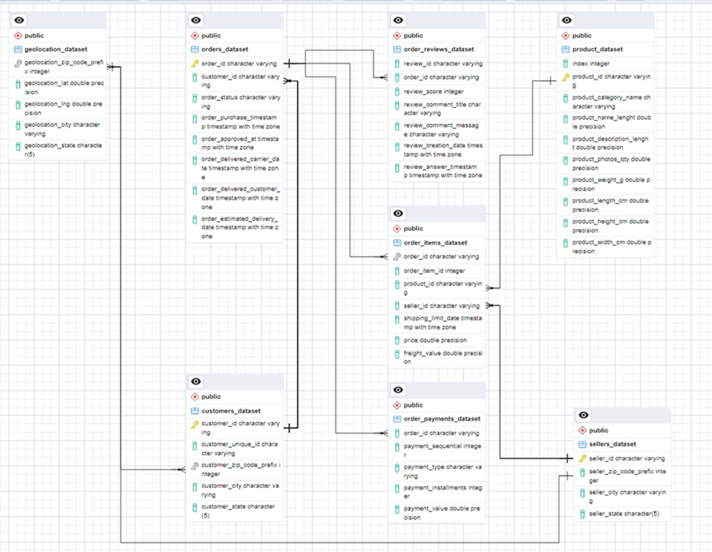
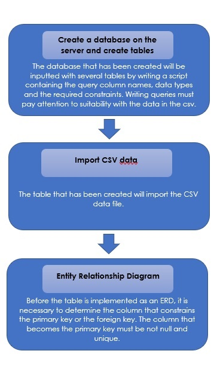
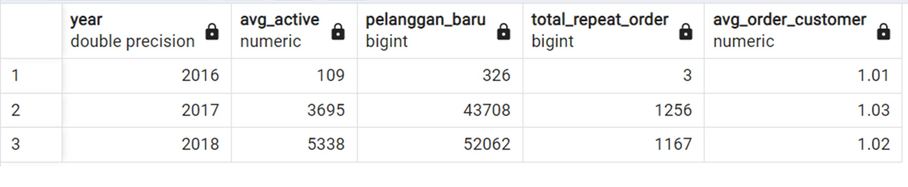
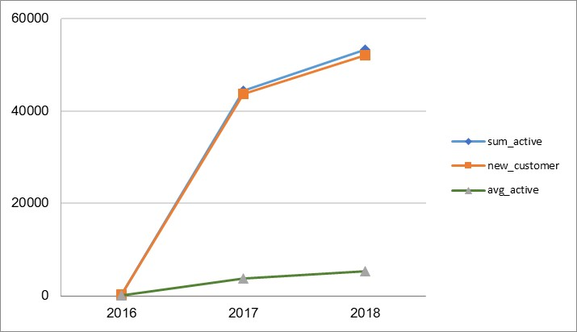
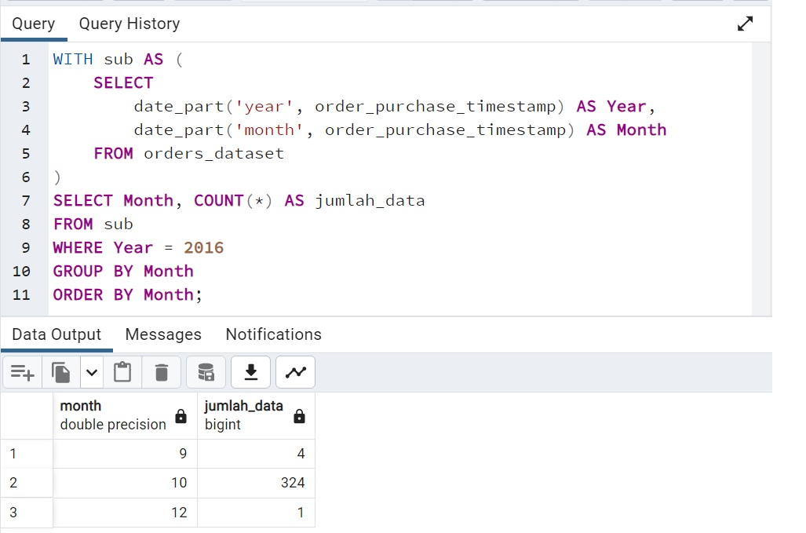
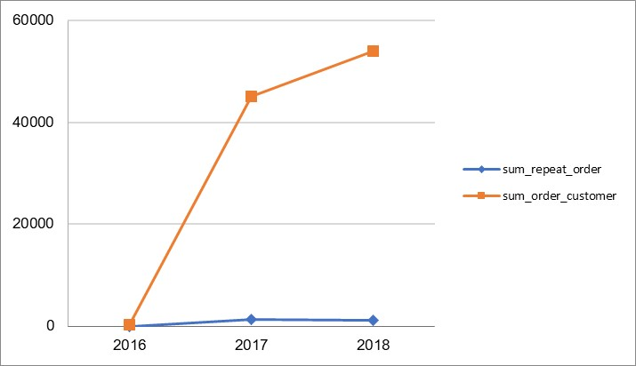
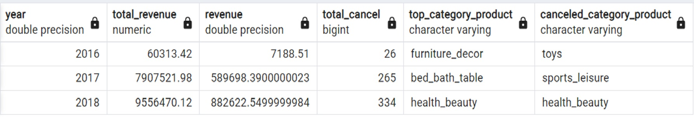
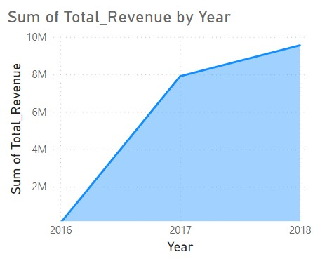
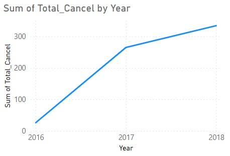

# Analyzing_eCommerce_Business_Performance_with_SQL
Analyze business performance for an eCommerce company, taking into account several business metrics, namely customer growth, product quality, and payment types

## OVERVIEW
“In a company, measuring business performance is very important to track, monitor, and assess the success or failure of various business processes. Therefore, this paper will analyze business performance for an eCommerce company, taking into account several business metrics, namely customer growth, product quality, and payment types.”
### Data Preparation

                                                            

### Annual Customer Activity Growth Analysis

Based on the results of the visualization of active customer data with new customer, it can be seen that the effect of adding new customers is on the number of active customers. This can be seen from the graphical movements between the two which are almost the same. 
Therefore, the company continues to strengthen its marketing to attract customer attetion. This data shows a very drastic increase from 2016 to 2017. This is because the data available in 2016 only starts in September and is very limited. However, the company experienced an increase in customer activity from 2017 to 2018.

Customers who place orders have increased from 2017 to 2018, as with active customers. However, it is different with customers who place orders again, which actually decreased from 2017 to 2018. Companies can evaluate the results of reviews of products sold to maintain sales quality and influence customers to reorder. So, it is hoped that in the following year, customer reorders will increase.

### Annual Product Category

  

Company data from 2017 to 2018 has been observed to experience increasing revenue movements. However, on the other side, it was found that the number of canceled orders also increased every year. Companies need to evaluate what are the biggest obstacles that cause customers to cancel orders, this can be known by providing reasons for canceling in the available column before each canceling order. From this insight, companies can reduce the number of canceled orders each year so that revenue from the company increases.