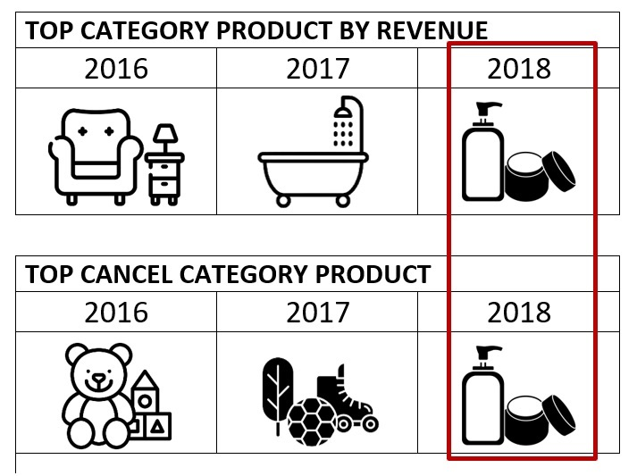
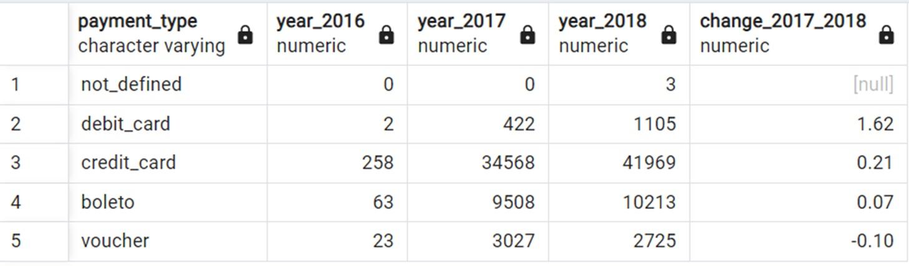
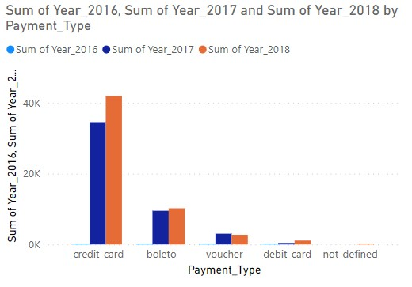
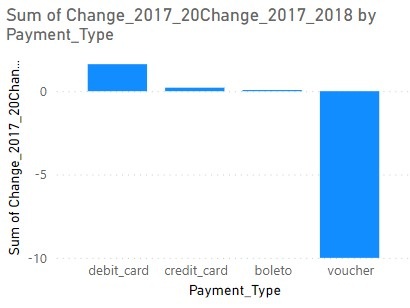

# Analyzing_eCommerce_Business_Performance_with_SQL
Analyze business performance for an eCommerce company, taking into account several business metrics, namely customer growth, product quality, and payment types

## OVERVIEW
“In a company, measuring business performance is very important to track, monitor, and assess the success or failure of various business processes. Therefore, this paper will analyze business performance for an eCommerce company, taking into account several business metrics, namely customer growth, product quality, and payment types.”
### Data Preparation

                                                                 

### Annual Customer Activity Growth Analysis

Based on the results of the visualization of active customer data with new customer, it can be seen that the effect of adding new customers is on the number of active customers. This can be seen from the graphical movements between the two which are almost the same. 
Therefore, the company continues to strengthen its marketing to attract customer attetion. This data shows a very drastic increase from 2016 to 2017. This is because the data available in 2016 only starts in September and is very limited. However, the company experienced an increase in customer activity from 2017 to 2018.

Customers who place orders have increased from 2017 to 2018, as with active customers. However, it is different with customers who place orders again, which actually decreased from 2017 to 2018. Companies can evaluate the results of reviews of products sold to maintain sales quality and influence customers to reorder. So, it is hoped that in the following year, customer reorders will increase.

### Annual Product Category

  

Company data from 2017 to 2018 has been observed to experience increasing revenue movements. However, on the other side, it was found that the number of canceled orders also increased every year. Companies need to evaluate what are the biggest obstacles that cause customers to cancel orders, this can be known by providing reasons for canceling in the available column before each canceling order. From this insight, companies can reduce the number of canceled orders each year so that revenue from the company increases.

It can be seen, the product categories that generate the most revenue experience differences every year. Likewise, product categories have the highest number of canceled orders each year. In this case, the Company needs to further analyze whether the product category that has the most revenue each year is the product that is trending in that year so that for the following year it can be predicted again which product category needs to be superior in that year.

In addition, from the data, it was found that the product category that generated the most revenue and had the most canceled orders in 2018 was the same product category, namely, Healthy Beauty. Further analysis needs to be done on Healthy Beauty products, whether product sales in 2018 are dominated by Healthy Beauty.

### Annual Payment Type Usage Analysis

  

It can be seen, the total usage of each type of payment at all times from 2016-2018, credit_card being the type of payment most often used. From this analysis, companies can focus on giving gifts or discounts for every product purchase by using a credit card to increase the number of product purchases.

While the type of payment that is minimally used by users is debit_card. However, there are interesting things that need to be analyzed more deeply, seen from the use of payment types in 2017 and 2018 debit cards experienced the biggest increase. Therefore it needs to be analyzed, what kind of marketing is used for debit card payment types in 2018 so that it can be applied to other types of payments.

Another analysis that needs to be considered is the type of voucher payment, because it can be seen based on 2017 and 2018 data that the type of voucher payment has decreased quite a bit.